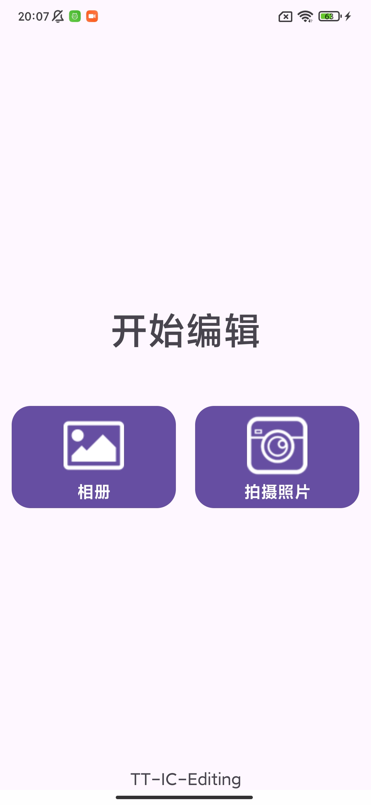
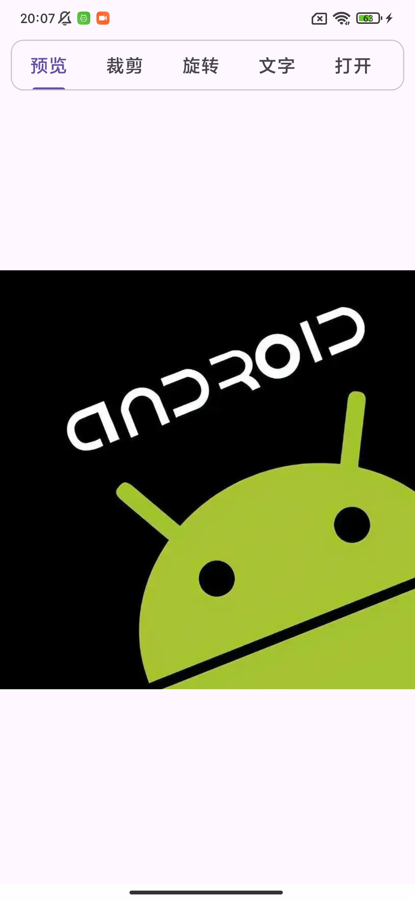
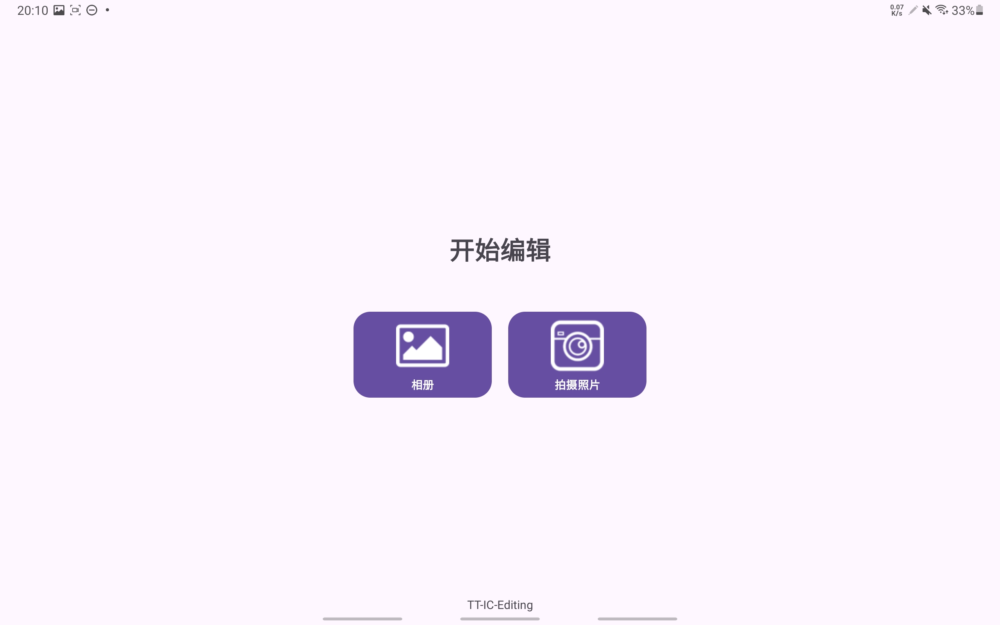
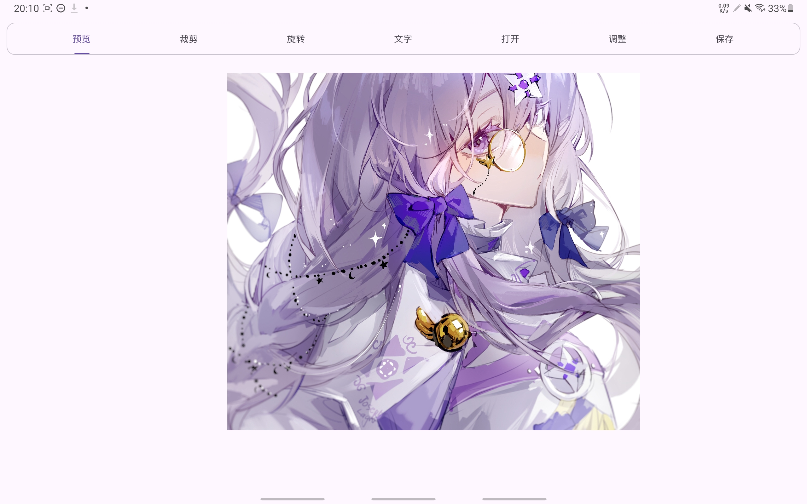

# TT-IC-Editing

## 1. 项目简介

本项目为一款轻量、高效的 Android 平台图片编辑工具，具有功能实用、体验良好等优势，主要面向广大用户日常使用。

### 1.1 主要功能

* 图片选取：支持从手机相册选取图片，选择后直接导入编辑器查看。

* 相机拍照：支持从相机拍照导入编辑器，拍照后的图片保存在手机相册，方便后续查看编辑。

* 图片查看：图片导入后自动适配编辑器界面，支持手势拖动和缩放查看。

* 图片裁剪：图片裁剪选项卡可对图片进行裁剪，包括自由比例和固定比例，支持结果确认和放弃。

* 旋转与翻转：旋转页面可对图像方向进行调整，支持图像90°顺时针旋转、90°逆时针旋转、180°旋转、水平翻转、垂直翻转等功能，操作过程中可实时查看效果，支持结果确认和放弃。

* 保存：编辑完成后可将图像保存至手机相册，保存成功后给出明确提示。

* 文字编辑：支持在图片上添加文字，可通过点击添加文字，双击对文字进行编辑，调整字体、字号、方向、颜色等，通过拖动编辑框对文字进行移动、缩放和旋转。

* 图片打开：编辑器页面可通过“打开”选项卡打开新的图片进行编辑。

* 夜间模式：应用已对夜间模式进行适配，支持切换日间/夜间模式，夜间模式下界面亮度降低、色调柔和，保护用户视力。

* 不同机型适配：应用已对手机、平板设备进行适配，支持全面屏设备，支持安卓7.0及以上设备。

### 1.2 演示视频/图片

**演示视频**

[demo.mp4](static/demo.mp4)

**手机UI界面展示**

**平板设备UI界面展示**

## 2. 开发环境

本项目基于Android平台，采用Kotlin语言进行开发，主要开发环境如下：

* Android SDK，最低SDK版本为24，目标SDK版本为36。

* Kotlin语言，版本2.2.21，JVM平台为11。

* 常用开发组件：Androidx Core、AppCompat、Material、Constraint Layout等。

* Jetpack LifeCycle ViewModel 组件，版本 2.10.0。

* 构建工具：Gradle 8.13。

## 3. 技术文档

### 3.1 简介

本项目主要包括2个Activity，分别为GreetingActivity和EditActivity：

* GreetingActivity：用于欢迎界面，提示用户从相册或相机拍照选取图片，获取到图片后以URI的形式跳转到EditActivity页面。

* EditActivity：核心的编辑器页面，提供图片编辑器的主要功能。图片编辑的核心功能通过 ImageEditCore
  类实现，编辑结果通过ImagePreview类实时展示。EditActivity支持加载不同的Fragment作为组件，提供不同的编辑功能。

### 3.2 模块功能介绍

项目主要模块如下：

* 编辑器核心组件：ImageEditCore

* 编辑器主页面：EditActivity

* 功能模块：
  
  - 预览功能模块：
    
    * 图片预览视图：ImagePreview
  
  - 裁剪功能模块：
    
    * 裁剪UI功能：ChopFragment
    * 裁剪效果预览：ChopView
  
  - 图片打开功能模块：
    
    * 图片打开UI功能：OpenFragment
  
  - 图片翻转/旋转功能模块：
    
    * 图片翻转/旋转UI功能：RotationFragment
  
  - 文字编辑模块：
  
    * 文字编辑UI功能：TextEditFragment
    * 文字编辑对话框，用于调整字体、颜色、文字内容等：TextEditDialog
    * 文字编辑预览：TextEditView

* 附加组件：
  
  - 拖动编辑框功能：DragBoxController
  - 拖动、旋转编辑框功能：DragableRotableController
  - 图像选择辅助类：ImagePicker
  - 欢迎页面：GreetingActivity

### 3.3 后续开发方向

* 滤镜和对比度调节功能。

* 贴纸功能。

* 图像拼接功能。

* 进一步优化客户端性能和用户体验，提示操作的流畅性。

## 4. 其他说明

作业 1、2、3 内容见项目链接 https://github.com/ls20001/TT-IC-Editing-Homework

# 5. 致谢

感谢字节跳动2026届客户端工程训练营 - TikTok Short Video - 智能创作 -
编辑团队的大力支持！感谢字节跳动2026届工程训练营全体项目人员及业务导师的付出。
